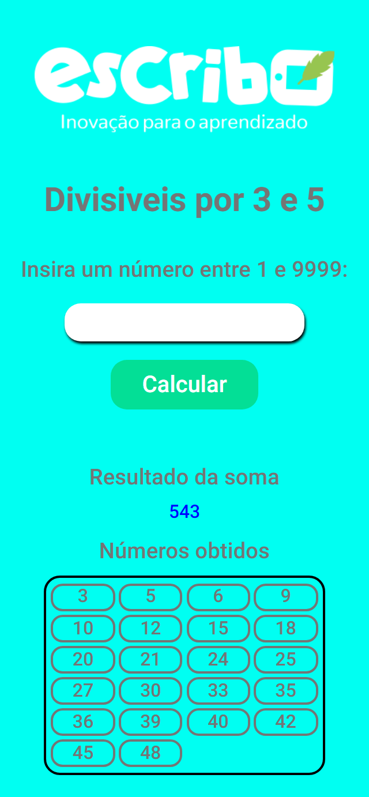
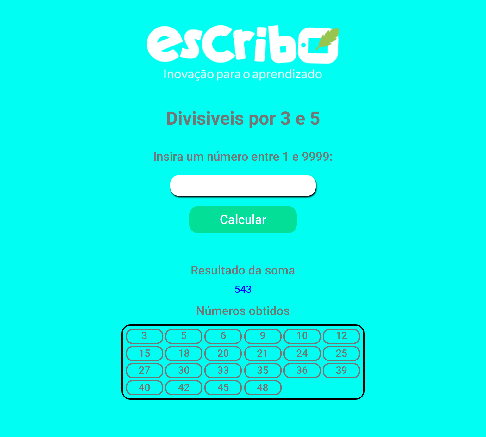
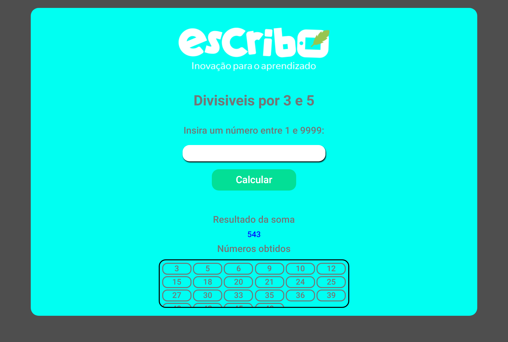

# Bem vindo ao projeto

Esse repositório é dedicado a um teste técnico para a [Escribo](https://escribo.com/). Está uma empresa voltada para a educação infantil com jogos pedagógicos, altamente estimulantes para o amadurecimento da educação.
Fiquei muito contente com o contato sobre a vaga de Flutter Iniciante e espero que fiquem satisfeitos com meu primeiro teste.

## Breve resumo
Agora vamos para a parte que interessa. 
Desenvolvi uma rápida aplicação com HTML, CSS e JavaScript para poder apresentar o projeto, se trata de um site onde você irá ter um campo de texto para inserir um número entre 1 e 9999, logo abaixo irá ter um espaço para apresentar a soma de todos os números divisíveis por 3 ou 5 abaixo do número inserido, olhando um pouco mais abaixo, você verá uma caixa com todos esses números para que possa conferir todos.

#  

##  

##  
 
Nessas screenshots, você poderá ver exemplos com o número 50.

## Chegou a melhor parte !!!
### Vamos testar!?
Para isso, é muito simples, você pode testar simplesmente acessar o [link do site](https://escribo.netlify.app).
